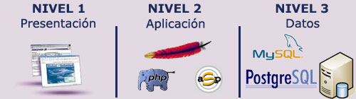
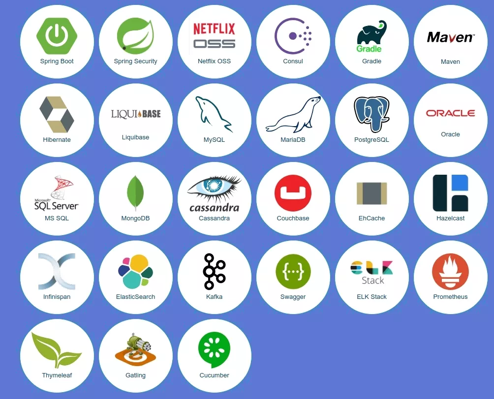
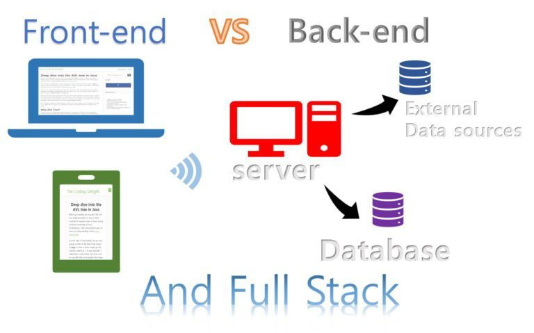

# Desenvolvemento web na entorna do servidor

Cando unha páxina web se descarga no teu ordenador, o seu código define que se debe mostrar en
pantalla. Este contido está programado nunha linguaxe de marcado formado por etiquetas HTML. O programador escolle de forma consciente cada etiqueta polo seu valor semántico -inda que non sempre!-. Asé as distintas etiquetas que compoñen a páxina indican o obxectivo de cada una das partes definidas, indicando cando un texto é unha cabeceira, cando se vai a amosar unha táboa ou unha imaxe; ou indicando que o contido se amose nun párrafo de texto.
Coa axuda dun pouco CSS e algo de Javascript a túa páxina web pode estar totalmente operativa. Pero por moito que explotes as posibilidades de cada linguaxe non vai deixar de ser o que coñecemos como unha páxina estática.

Isto non é o que ocorre coas páxinas dinamicas.

### Modelos de execución de código en servidores e clientes web

O modelo ou estrutura hardware aplicado ao desenvolvemento web se sostén, nunha [arquitectura cliente-servidor](https://gl.wikipedia.org/wiki/Arquitectura_cliente-servidor). Neste patrón de arquitectura existen dous actores, o cliente e o servidor, de xeito que o primeiro é quen se conecta có segundo para solicitar algún servizo. No desenvolvemento web, os clientes solicitan que se lles sirva unha web para visualizala, ou tamén consumir diversos servicios web. Neste modelo o escenario se repite: un servidor se está executando ininterrupidamente agardando que os posibles clientes fagan unha solicitude.

A maior esixencia para este modelo e ser capaz de atender simultaneamente a múltiples peticións de numerosos clientes.

A diferencia sustancial entre o cliente e o servidor é o software con que se fornece un equipo informático. Segundo a especificidade do software empregado no desenvolvemento web se formula un [modelo de tres capas](https://gl.wikipedia.org/wiki/Programaci%C3%B3n_por_capas).

### Modelo de desenvolvemento de 3 capas

* **Capa de presentación**: É a capa onde a aplicación se expón as persoas. Básicamente é a capa gráfica ou GUI (Graphical User Interface, Interfaz Gráfica de Usuario). No caso dunha aplicación web sería o código HTML que se carga directamente no navegador web. Esta capa se executa directamente no equipo do cliente.
  
* **Capa de negocio**:  É a capa intermedia onde se leva a cabo toda a lóxica da aplicación. Esta capa, tras realizar todos os cálculos e/ou operaciónss sobre os datos, xera o código HTML que será presentado as persoas na capa anterior(seguinte?). Sempre se executará no lado do servidor. 
  
* **Capa de datos**: É a capa que almacena os datos. Básicamente, en condiciones normais, fai referencia ao [SGBD](https://es.wikipedia.org/wiki/Sistema_de_gesti%C3%B3n_de_bases_de_datos) (sistema de xestión de bases de datos) que é o encargado de almacenar os datos. Dependendo da arquitectura da aplicación, esta capa  e a capa de negocio se poden atopar fisicamente no mesmo equipo, inda que por razóns de rendemento tamén é posible que se teñan que separar. A capa de datos sirve toda a información necesaria á capa de negocio para que está complete as súas operacións.

Imaxina unha tenda online:
- a **capa de datos** almacena toda a información nunha base de datos (usuarios, pedidos, artigos, ofertas,...), 
- a **capa de negocio** debe acceder a esa información e, despois de procesar toda a información sobre unha consulta ou un pedido, por exemplo, debe presentar o resultado final...
- no navegador, que é a **capa de presentación**.

Se ollamos un caso concreto con software e tecnoloxías xa definidos, un modelo de 3 capas podría ser o seguinte:

Modelo de desenvolvemento de 3 capas segundo o software empregado en cada capa:

* **Un navegador web**: Firefox, Edge, Opera, Safari ou Google Chrome son as aplicacións que se ocupan da capa de presentación. Son a capa de representación.
  
* **[Apache](https://httpd.apache.org/) + PHP / IIS + ASP**: Un [servidor web](https://tecnogaming.com/web-servers-nginx-vs-apache-vs-lighttpd/) fornecido da linguaxe de programación axeitada permite xestionar a capa de negocio. Hai diversas opcións. Ao software servidor hai que provelo dunha linguaxe de guión que permita desenvolver a lóxica da aplicación.
  
* **MySQL/PostgreSQL**: Para a xestión da capa de datos se emprega algún software ou sistema de xestión de bases de datos, como poden ser _MySQL_ ou _PostgreSQL_
* MySQL: es un sistema de gestión de bases de datos relacional desarrollado bajo licencia dual: Licencia pública general/Licencia comercial por Oracle Corporation

#### Front-end, Back-end, Full stack

Segundo en que lado se ubican as tecnoloxías e para qué son empregadas podemos definir 3 perfiles diferenciados no ámbito do desenvolvemento web:

* **Front-end**: É a parte do desenvolvemento que se encarga do deseño e a maquetación da aplicación web utilizando tecnoloxías coma HTML, CSS e Javascript (e os seus diferentes frameworks). Ocupándose do deseño responsivo, a codificación semántica e a accesibilidade e usabilidade do sitio. O coidado na codificación nesta parte do desenvolvemento tamén pode contribuir ao posicionamento en buscadores. *SEO orgánico*
  
* **Back-end**: É a parte do desenvolvemento que se encarga do lado servidor utilizando tecnoloxías como PHP, JS ou Python. Tamén se encarga da administración do servidor de aplicacións e das bases de datos.
  
* **Full stack**: Este perfil engloba os dous anteriores. Neste caso o desenvolvedor pode que non sexa un experto nunha tecnoloxía concreta, pero ten amplos coñecementos de conxunto e pode ser capaz de participar en cualquiera de las partes.

## Servidores web e servidores de aplicacións

Así como as aplicacións de escritorio se executan directamente sobre o teu Sistema Operativo, as páxinas e aplicacións web necesitan dunha ferramenta adicional que permita despregalas para a súa posta en marcha. Esas ferramentas son os servidores web e os servidores de aplicacións, respectivamente.

#### Que é un servidor web?

Un servidor web é unha aplicación que recibe una petición HTTP (normalmente a través dun navegador web) e devolve a páxina web solicitada (marcada en linguaxe HTML, e contidos de código Javascript inscrustado ou dependencias CSS) para que ésta sexa interpretada e presentada no navegador da persoa que realizou a solicitude (o usuario).

#### Que é un servidor de aplicacións

Un servidor de aplicacións é unha aplicación que conten unha serie de servizos que son accesibles a través dunha API exposta a través de Internet. Normalmente os servidores de aplicacións proporcionan máis servizos que os servidores web. Por exemplo, no caso dos servidores de aplicacións para _Java_ ou _Python_, estes proporcionan un acceso transparente á base de datos para que o desenvolvedor se centre exclusivamente en implementar a capa de negocio. A demais, poden proporcionar tamén servizos como fail-over ou balanceo de carga.

## **Tecnoloxías para o desenvolvemento web**

O seguinte paso é falar das diferentes linguaxes de programación que existen dirixidos ao desenvolvemento web. Pero, antes de entrar en materia, conven facer unha distinción entre a definición de **tecnoloxías** **frontend** e **tecnoloxías** **backend**.

Entendemos por **tecnoloxías frontend** ao **conxunto de tecnoloxías que funcionan e traballan do lado do cliente**. Polo contrario as **tecnoloxías backend** son **aquelas que funcionan e operan do lado dos servidores**. Actualmente algunhas das linguaxes que se poden atopar para desenvolvemento web son:

 

### **Tecnoloxías frontend**

 

[**HTML5**](http://w3c.github.io/html/introduction.html): É a tecnoloxía principal utilizada para estructurar os contidos na web, estandarizada pola [w3c](https://en.wikipedia.org/wiki/World_Wide_Web_Consortium). É un linguaxe de marcado que permite crear a estructura e elementos dunha web que despois serán interpretados polos navegadores.

**CSS**: A súa función é describir como as estruturas HTML definidas anteriormente deben representarse visualmente. HTML foi creado para describir o contido nas páxinas web, CSS define os estilos visuais que terá ese contido. Combinando **HTML** e **CSS** en dous arquivos separados, é posible separar o contido e a presentación dunha web de forma clara e organizada, facilitando o traballo dos desenvolvedores.

**JavaScript**: É común que as webs incorporen dinamismo, permitan realizar accións sen necesidade de refrescar a páxina e actualicen os datos en pantalla de forma automática e rápida. Para lograr que as webs teñan estes comportamentos se usa Javascript, unha linguaxe empregada para aportar interactividade, reactividade ante eventos, validación dos datos en formularios, crear cookies, etc.

Arredor destas 3 tecnoloxías se crean frameworks de desenvolvemento web que permiten crear páxinas web cada vez máis complexas e funcionalidades que aportan cada vez máis valor. As últimas tendencias de desenvolvemento web nesta área son:

**Frameworks e librerías JavaScript:** coa finalidade de mellorar o desenvolvemento de JavaScript en proxectos grandes, van aparecendo - e desaparecendo!- frameworks e librerías como [Angular](https://angular.io/), [Vuejs](https://vuejs.org/) ou [React](https://reactjs.org/). O ecosistema **JavaScript** medra ano a ano e tódolos días se crean novas librerías. Unha boa referencia para manterse actualizados nestes avances [é esta guía](https://stateofjs.com/). Tamén xurden ferramentas para poder probar webs baseadas nestes frameworks, algúns exemplos son [Jest](https://jestjs.io/), [Protactor](https://www.protractortest.org/), [Mocha](https://mochajs.org/), [Karma](http://karma-runner.github.io/), [Enzyme](https://airbnb.io/enzyme/)...

**Frameworks e librerías CSS**: ao igual que ocorre con **JavaScript**, tamén aparecen novas librerías e frameworks para **CSS** que permiten xestionar mellor o desenvolvemento de aplicacións. Os máis coñecidos e utilizados son **Bootstrap e Material Design, **pero hai máis: PureCSS, Foundation, Milligram,.... Tamén están os denominados **preprocesadores**: programas que permiten estender as funcións CSS cunha sintaxe única que despois será transformada a CSS orixinal. Algúns exemplos destes preprocesadores son: [Sass](https://sass-lang.com/), [Less](http://lesscss.org/), [Stylus,](http://stylus-lang.com/) ou [PostCSS](https://postcss.org/).

**Xestores de paquetes:** co fin de xestionar librerías e plugins os desenvolvedores utilizan xestores de paquetes, sendo os máis estendidos [npm](https://www.npmjs.com/) e [yarn](https://yarnpkg.com/).

Ferramentas para **construcción e desenvolvemento do código**: as máis destacadas aquí son [NPM Scripts](https://medium.freecodecamp.org/introduction-to-npm-scripts-1dbb2ae01633), [Gulp](https://gulpjs.com/), [Webpack](https://webpack.js.org/) e [Rollup](https://rollupjs.org/).

> *Unha web para ver as tendencias máis actuais no desenvolvemento web:* https://trends.uxdesign.cc/

### Linguaxes e tecnoloxías para programación web na contorna do servidor

#### PHP

[PHP](https://www.php.net/manual/es/index.php "https://www.php.net/manual/es/index.php") (acrónimo recursivo de Hypertex Preprocessor) é unha linguaxe de programación do lado servidor deseñado principalmente para o desesenvolvemento web.

Se emprega coma linguaxe de guión embebido en páxinas HTML e funciona, normalmente, coma un módulo do servidor web (por exemplo, en Apache). O servidor web combina os resultados de executar os scripts PHP có HTML no que vai embebido e xera o marcado da páxina web que se expón ao navegador.

Actualmente PHP funciona practicamente con calquera servidor web e en calquera Sistema Operativo, e case con calquera SGBD en caso de que necesitemos utilizar una Base de Datos. A pesar de ello, lo más habitual es verlo formando lo que se conoce como una arquitectura LAMP (Linux, Apache, MySQL y PHP), es decir, funcionando sobre un Sistema Operativo Linux, ejecutándose como un módulo del servidor web Apache y utilizando a MySQL como SGBD para almacenar la información en caso de que se requiera una Base de Datos.

### Linguaxes de guión:
* Python
* Ruby
* JavaScript (Nodejs)
* PHP

### Linguaxes funcionais:
* Elixir
* Scala
* Java
* Clojure

### Outras opcións:

* Golang
* Rust

En función da linguaxe existen diferentes **frameworks que permiten o desenvolvemento a gran escala**, os máis populares na actualidade son:

* [Phoenix](https://github.com/phoenixframework/phoenix) (Elixir)
* [Meteor](https://www.meteor.com/) (JavaScript Nodejs)
* [Ruby on Rails](https://rubyonrails.org/) (Ruby)
* [Django](https://www.djangoproject.com/) (Python)
* [Flask](http://flask.pocoo.org/) (Python)
* [Spring Boot y Spring Cloud](https://spring.io/) (Java)

As tipoloxías das **bases de datos** máis utilizadas son:
* Relacionales: MySQL, MariaDB, PostgreSQL, Oracle.
* NoSQL: MongoDB, Cassandra, CouchBase, RethinkDB, Elastic Search, Neo4j

Nas arquitecturas distribuidas é común o intercambio de mensaxes entre os distintos módulos software, para iso se emprega **middleware de mensaxería** coma:
* RabbitMQ
* Kafka

Os motores de busca ou **Search Engines** forman tamén parte do software empregado no lado do servidor:
* ElasticSearch
* Solr
* Sphinx

Coma tamén os sistemas de cacheo:
* Redis
* Memcached

Outro factor a ter sempre en conta é a **seguridade**, crucial en calquera contorna, as metodoloxías máis comúns de **autenticación e autorización** son:
* OAuth
* Autenticación básica
* Autenticación por token
* JWT
* OpenID

Có crecente aumento dos servizos na nube, medra a demanda de expertos na área DevOps, personal especializado en tarefas coma:

* **Linguaxes de programación:** Go, Rust, C, C++, Python, Ruby, JavaScript (Nodejs)
* **Sistemas Operativos:** xestión de procesos, fíos e concurrencia, sockets, xestión I/O, virtualización.
* **Xestión de Servidores:** Linux, Windows.
* **Proveedores de servizos cloud:** Amazon Web Services, Google Cloud Platform, Azure, Digital Ocean.
* **Redes e Seguridade:** DNS, OSI Model, SSH, HTTP, HTTPS, FTP, SFTP, SSL / TLS.
* **Aprovisionamento de infraestruturas IT:** Contedores (Docker), Xestión da Configuración (Ansible), Orquestación (Kubernetes), Aprovisionamento (Terraform)
* **Integración Continua e Entrega Continua:** Jenkins, Circle CI, Gitlab.
* **Monitorización de infraestructura e aplicacións:** Nagios, Datadog, NewRelic, Zabbix.
* **Xestión de logs, eventos e notificacións:** ELK, Graylog, Splunk, Papertrail.

---
Para completar a vision do desenvolvemento do lado do servidor se recomenda ler:
- [Programación de sitios web no servidor](https://developer.mozilla.org/en-US/docs/Learn/Server-side)
- [Que é un servidor web?](https://developer.mozilla.org/en-US/docs/Learn/Common_questions/What_is_a_web_server)
- [Que software necesito?](https://developer.mozilla.org/en-US/docs/Learn/Common_questions/What_software_do_I_need)

ref: https://servidor.codeandcoke.com/apuntes:introduccion 
