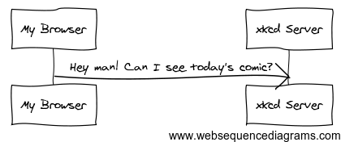

## 1.1. HTTP é sinxelo

HTTP ("HyperText Transfer Protocol") é unha linguaxe baseada en texto que permite a dúas máquinas comunicarse entre sí. E non hai máis! 
Unha conversación é a que por exemplo se produce cando queres acceder á última tira cómica publicada polo sitio [xkcd](https://xkcd.com/):


**Figura 1.1** Fluxo HTTP para obter a tira cómica máis recente de Xkcd.

Non importa como programela túa web nin en que tecnoloxías te apoies para desenvolvela e publicala, o obxectivo do teu servidor sempre é entender as peticións de texto simple, e devolver respostas en texto simple.

### 1.1.1. Paso 1: O cliente envía unha petición

Tódalas conversacións na web comenzan cunha **petición**. A petición é unha mensaxe de texto creado por un cliente (por exemplo un navegador, unha aplicación para o iPhone, etc.) nun formato especial coñecido como HTTP. O cliente envía a petición a un servidor, e logo espera a resposta.

Bota unha ollada á primeira parte da interacción (a petición) entre un navegador e o servidor web do sitio `xkcd`:



**Figura 1.2** Petición HTTP para obter a tira cómica máis recente de Xkcd

Utilizando a linguaxe HTTP, esta petición en realidade sería algo parecido ao seguinte:

```bash
GET / HTTP/1.1
Host: xkcd.com
Accept: text/html
User-Agent: Mozilla/5.0 (Macintosh)
```

Este sinxelo mensaxe comunica todo o necesario sobre que recursos solicita o cliente exactamente. 
A primeira líña dunha petición HTTP é a máis importante e conten dúas cosas: la URI y el método HTTP.

A URI (por exemplo, `/`, `/contacto`, etc.) é a dirección ou localizador que identifica univocamente ao recurso que solicita o cliente. 
O método HTTP (por exemplo, `GET`) define o que queres facer có recurso. Os métodos HTTP son os *verbos* da petición e definen as poucas formas en que podes actuar sobre o recurso:

| Método   | Acción                              |
| -------- | ----------------------------------- |
| `GET`    | Recupera o recurso desde o servidor |
| `POST`   | Crea un recurso no servidor         |
| `PUT`    | Actualiza o recurso no servidor     |
| `DELETE` | Elimina o recurso do servidor       |

Tendo isto en conta, podes imaxinar como sería por exemplo a petición HTTP necesaria para borrar un artigo específico dun blog:

```bash
DELETE /blog/15 HTTP/1.1
```

**Nota**: En realidade, hai nove métodos HTTP definidos pola especificación HTTP, pero moitos deles non se utilizan ou non están soportados. De feito, moitos navegadores modernos non soportan os métodos `PUT` e `DELETE`.

A demais da primeira liña, unha petición HTTP conten tamén outras liñas de información coñecidas como **cabeceiras de petición**. As cabeceiras proporcionan moita información, coma o servidor (`host`) solicitado, os formatos de resposta que acepta o cliente (`Accept`) e a aplicación que utiliza o cliente para realizar a petición (`User-Agent`). Existen moitas outras cabeceiras e se poden atopar no artigo *[Lista de campos das cabeceiras HTTP](https://en.wikipedia.org/wiki/List_of_HTTP_header_fields)*  na Wikipedia.   

### 1.1.2. Paso 2: O servidor devolve unha resposta

Unha vez que un servidor recibiu a petición, sabe exactamente que recursos necesita o cliente (a través da URI) e o que o cliente quere facer con ese recurso (a través do método). Por exemplo, no caso dunha petición `GET`, o servidor prepara o recurso e o devolve nunha resposta HTTP. Considera a resposta do servidor web do sitio `xkcd`:


**Figura 1.3** Resposta HTTP para obter a tira cómica máis recente de Xkcd

Traducida a HTTP, a resposta enviada de volta ao navegador é  similar ao seguinte:

```html
HTTP/1.1 200 OK
Date: Sat, 02 Apr 2011 21:05:05 GMT
Server: lighttpd/1.4.19
Content-Type: text/html

<html>
  <!-- HTML de la tira cómica de Xkcd -->
</html>
```

A resposta HTTP conten o recurso solicitado (neste caso, o contido HTML dunha páxina web), así como outra información acerca da resposta. A primeira liña é especialmente importante e conten o código de estado HTTP da resposta (neste caso `200`). O código de estado indica o resultado global da petición devolta ao cliente. Tivo éxito a petición?  Houbo algún erro? Existen diferentes códigos de estado que indican éxito, erro ou que máis se necesita facer có cliente (por exemplo, redirixilo a outra páxina). A lista completa se pode atopar no artigo *[Lista de códigos de estado HTTP](https://es.wikipedia.org/wiki/Anexo:Códigos_de_estado_HTTP)* na Wikipedia.

Ao igual que a petición, unha resposta HTTP conten datos adicionais coñecidos como cabeceiras HTTP. Por exemplo, unha cabeceira importante da resposta HTTP é `Content-Type`. Un mesmo recurso se pode devolver en varios formatos diferentes (HTML, XML, JSON, etc.) e a cabeceira `Content-Type` lle di ao cliente que formato se está a empregar (para iso se utilizan valores estándar como `text/html` que se coñecen como *Internet Media Types*, tipos de medios de Internet). Podes atopar a lista completa de tipos de contido no artigo *[Lista de tipos de contido de Internet](https://en.wikipedia.org/wiki/Internet_media_type#List_of_common_media_types)* na Wikipedia.

*Existen moitas outras cabeceiras, algunhas moi importantes. Por exemplo, certas cabeceiras se poden usar para crear un bastante interesante sistema de memoria caché.*

### 1.1.3. Peticións, respostas e desenvolvemento web

Esta conversación petición-resposta é o proceso fundamental no que se basea toda a comunicación na web. E a pesar de ser tan importante e poderoso, é ao mesmo tempo ben sinxelo.

O concepto máis importante é o seguinte: independentemente da linguaxe que utilices, o tipo de aplicación que constrúas (web, móbil, API), ou a filosofía de desenvolvemento que sigas, o obxectivo final dunha aplicación sempre é entender cada petición e crear e devolver a resposta axeitada.

**Atallo**: Podes obter máis información acerca da especificación HTTP, na referencia orixinal [HTTP 1.1 RFC](https://www.w3.org/Protocols/rfc2616/rfc2616.html). Tamén podes ler a referencia [HTTP Bis](https://datatracker.ietf.org/wg/httpbis/), que é unha versión actualizada e máis detallada da referencia anterior. Unha gran ferramenta para comprobar tanto a petición como as cabeceiras da resposta mentras navegas é a extensión *[Live HTTP Headers](https://addons.mozilla.org/en-US/firefox/addon/live-http-headers/)* de Firefox ou o *Inspector Web* dos navegadores Chrome, Edge e Safari.


# 1.2. Peticións e respostas en PHP

Como interactúar coa "petición" e crear unha "resposta" empregando PHP? En realidade, PHP abstrae un pouco todo o proceso:

```
<?php
$uri = $_SERVER['REQUEST_URI'];
$foo = $_GET['foo'];

header('Content-type: text/html');
echo 'A URI solicitada é: '.$uri;
echo 'O valor do parámetro "foo" é: '.$foo;
```

Por estraño que pareza, esta pequena aplicación está obtendo información da petición HTTP e a utiliza para crear unha resposta HTTP. En lugar de analizar a mensaxe HTTP da petición, PHP crea *variables superglobais* como `$_SERVER` e `$_GET` que conteñen toda a información da petición. Do mesmo xeito, en lugar de devolver a resposta HTTP con formato de texto, podes usar a función `header()` para crear as cabeceiras da resposta e simplemente imprimir o contido que se enviará na mensaxe da resposta. Despois PHP crea a verdadeira resposta HTTP que se devolve ao cliente:

```
HTTP/1.1 200 OK
Date: Sat, 03 Apr 2011 02:14:33 GMT
Server: Apache/2.2.17 (Unix)
Content-Type: text/html

A URI solicitada é: /testing?foo=symfony
O valor do parámetro "foo" é: symfony
```

O verdadeiro traballo ven ao escribir o código que interpreta a información da petición e crea a resposta.


# 1.3. A viaxe da petición á resposta

A túa aplicación probablemente fai unha chea de cosas: enviar correo electrónico, manexar formularios, gardar contidos nunha base de datos, reproducir as páxinas HTML e protexer o contido con seguridade. Como podes manexar todo isto e ao mesmo tempo conseguir que o teu código estea organizado e sexa fácil de manter?

Podes facer todo isto a man e inventar a roda algún día. Ou axudarte de marcos de desenvolvemento que resolvan todos estes asuntos ou que polo menos cho poñan máis fácil.

### 1.3.1. O controlador frontal

Antes, as aplicacións web se construían de xeito que cada páxina web do sitio tiña o seu arquivo físico propio:

```
index.php
contacto.php
blog.php
```

Esta filosofía de traballo presenta varios problemas, como a falta de flexibilidade das *URL* (que pasa se queres cambiar `blog.php` a `noticias.php` sen romper todos os teus enlaces?) e o feito de que cada arquivo debe incluír a man todos os arquivos necesarios para a seguridade, conexións á base de datos e para aplicar os estilos gráficos do sitio.

Unha solución moito mellor é usar un *controlador frontal*, que é un só arquivo PHP que se encarga de servir todas as peticións qu chegan a túa aplicación. Por exemplo:

| Arquivo solicitado    | Arquivo realmente executado |
| --------------------- | --------------------------- |
| `/index.php`          | `index.php`                 |
| `/index.php/contacto` | `index.php`                 |
| `/index.php/blog`     | `index.php`                 |

**Atallo:** Usando o módulo `mod_rewrite` de *Apache* (ou un equivalente noutros servidores web), as *URL* se poden *limpar* facilmente para que quiten a parte do`index.php` e se queden simplemente en `/`, `/contacto` e `/blog`.

Agora, tódalas peticións se manexan exactamente igual. En lugar de URL individuais executando diferentes arquivos PHP, o controlador frontal sempre se executa, e a redirección de cada URL a unha parte diferente da aplicación se realiza internamente. Desta forma podemos resolver de xeito centralizado os problemas comentados anteriormente. 

Case tódalas aplicacións web modernas seguen a filosofía do *controlador frontal*, incluíndo aplicacións como *WordPress*.


DEC 2021

---

_ref:_ https://uniwebsidad.com/libros/symfony-2-4/capitulo-1

###### 
