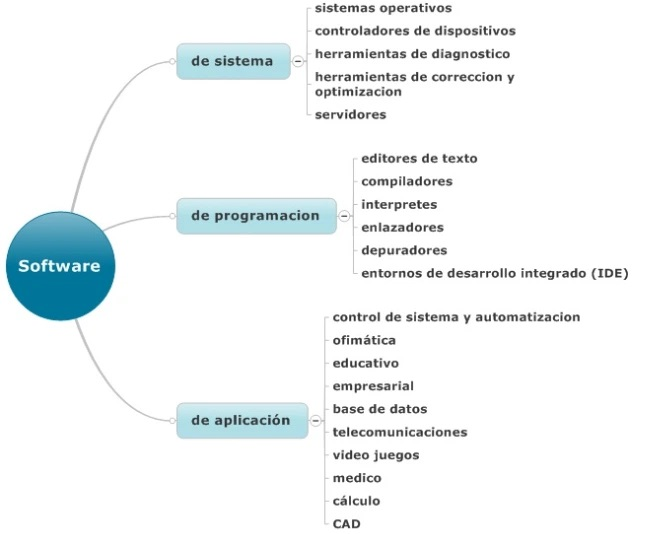
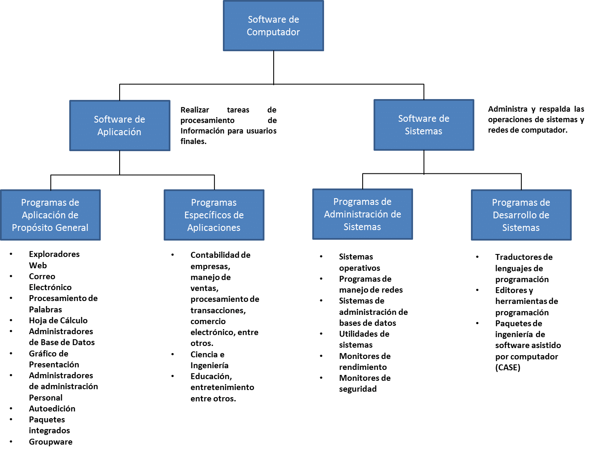
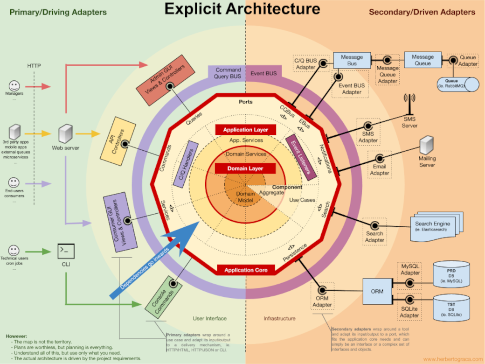

# Tipos de software e diferencias que debemos coñecer

De forma global é fácil **entender que é o software**, dado que convivimos con el. Son programas, datos ou métodos de funcionamento a modo de instrucións a través das que os equipos informáticos realizan tarefas. O software se emprega non só en ordenadores, senón que se trata do tipo de ferramenta que tamén se aplica no caso de dispositivos móbiles, consolas e todo tipo de maquinaria.

E inda que a definición e o concepto sexan fáciles de entender, sabes que tipos de software existen? 

Hai moitos tipos de software, cada uno con funcións e características diferenciadas. **Segundo o cometido ou obxectivo** que ten dentro do sistema informático, atopamos diferentes tipos de software:

- Software de programación
- Software de sistema
- Software de aplicación

## **Software de programación**

O software de programación son aquelas **ferramentas que utilizan os profesionais** como base para a elaboración de programas. Son as ferramentas de traballo do programador. Hai distintos tipos que se utilizan dependendo do momento. O seu uso combinado é o que permite a creación de software para todo tipo de usos. Por exemplo, nesta categoría se inclúen os **editores de texto**, os **compiladores** ou os **depuradores**. Para algúns profesionais o máis idóneo son os IDE, un tipo de software de programación que aporta versatilidade debido a que engloba distintas ferramentas das antes mencionadas para unha maior facilidade no traballo.

A través do coñecemento lóxico e de linguaxe(s) de programación orientada a obxectos, é posible desenvolver utilidades dixitais para que exerzan diversas funcións.

Estes programas é onde se escribe o código para desenvolver novos sistemas dentro dun sistema operativo.

## **Software de sistema**

O software de sistema é de seu o grupo máis importante. Son a ferramenta que sirve a modo de motor do equipo no que se instala. Son os sistemas operativos (SO) dos dispositivos. Os que lle permiten as persoas usar a interface do sistema operativo que ven incorporado co dispositivo. Os SO teñen dúas funcións principais:

- Unha: servir como interface de control ao usuario, **ofrecendo unha experiencia de uso** para que se poida controlar e interactuar con algún sistema/dispositivo e **convertendo nunha ferramenta funcional** os datos de programación.
- A outra: xestionar os recursos físicos do aparato para coordinar tarefas e administrar a memoria. De maneira simple, podemos decir que o software de sistema *crea o sistema* de acceso aos recursos hardware tanto de forma independiente como en combinación con compoñentes e accesorios conectados (desde a memoria interna ata o disco duro ou o teclado).

Alguns bos exemplos son os sistemas operativos Windows ou OSX, Android ou IOS, e tamén as máquinas virtuais, os controladores de dispositivos ou as [BIOS](https://www.ionos.es/digitalguide/servidores/know-how/que-es-la-bios-de-un-ordenador/) e os [bootloaders](https://www.ionos.es/digitalguide/servidores/configuracion/que-son-los-bootloaders/). Sen o software de sistema simplemente os dispositivos e máquinas non operarían.

## **Software de aplicación**

No último grupo está o software de aplicación, que como o nome indica son aqueles programas cos que as persoas poden realizar algún tipo de función. 

Conten todos e cada un dos programas e utilidades que derivan dunha programación de software e, que cumpren una tarefa específica, en case calquera área de la vida diaria, que se usan a través de dispositivos móbiles e computadores.

Dentro desta categoría se inclúe **multitude de tipos de ferramentas e contido**. Dado que a definición é tan flexible, abarca desde os simples editores de texto ata o máis sofisticado videoxogo. Se ben en términos xerais o software de aplicación non podería existir sen o software de programación e o software de sistema, o certo é que resulta igual de importante.

A demais do mencionado, se inclúen na **definición de software de aplicación** os programas empresariais, as ferramentas de deseño e tratamento da imaxe, as bases de datos, as ferramentas de cálculo e calquera outro tipo de software que proporcione unha función, abarcando por suposto toda a ofimática.

O software de aplicación ou simplemente as aplicacións son o produto final que se ofrece ao consumidor.

## Algúns exemplos que poden encaixar para cada tipo de software

### 1. Tipos de software de programación

- **editores de texto**: serven para crear e xestionar arquivos dixitais compostos por texto. Cumpren coa función de ler o arquivo e interpretar os bytes segundo o código do editor;
- **compilador**: unha especie de tradutor que transforma a linguaxe de programación nun programa comprensible para un sistema;
- **intérprete**: basicamente é un programa que analiza e transforma información doutros programas;
- **enlazador**: toma os obxectos iniciais do proceso de compilación, descarta os non necesarios e enlaza un código aberto coa biblioteca interna e produce un arquivo executable;
- **depuradores**: programa que serve para «limpar» erros de otros programas;
- **IDE**: as entornas de desenvolvemento integrado son aplicacións que lle ofrecen ao programador servizos integrais para facilitar o desenvolvemento de todo tipo software.

### 2. Tipos de software de sistema

- **cargador de programa**: parte do sistema operativo que cumpre coa función de enviar información á memoria do sistema para executar programas;
- **sistemas operativos**: sistema que xestiona os recursos de [hardware](https://gl.wikipedia.org/wiki/Hardware) e brinda ao usuario a posibilidade de lanzar aplicacións;
- **controladores**: programas que permiten ao SO realizar interaccións entre o hardware e a interface de usuario para utilizar o dispositivo;
- **ferramentas de diagnóstico**: serven para monitorear e controlar a funcionalidade dos recursos físicos do dispositivo;
- **servidores**: ferramentas de execución que serven para recibir as indicacións do usuario e realizar unha acción en concordancia.

### 3. Tipos de software de aplicación

- **aplicacións de ofimática**: son todas aquelas utilidades informáticas que están deseñadas para tarefas de oficina co obxectivo de optimizar, automatizar e mellorar as tarefas nesta actividade;
- **bases de datos**: colección de información dixital organizada que poida ser accedida en calquera momento, ben na súa totalidade ou a fragmentos.
- **videoxogos**: xogos electrónicos onde unha ou máis persoas interactúan con imaxes de vídeo a través de controis físicos ou movementos corporais;
- **software empresarial**: pode dicirse que é toda aquela aplicación que está creada para optimizar, automatizar ou medir a produtividade dalgunha industria ou empresa;
- **software educativo**: todos aqueles produtos dixitais que teñen coma obxectivo ensinar algún tema en específico ao usuario de calquera nivel e facilitar o proceso de aprendizaxe;
- **software de xestión**: sistema integrado por varias ferramentas para ser utilizado en tarefas relacionadas coa administración ou o cálculo numérico.

## **Diferencias dependendo do modelo de distribución**

**Outra maneira de dividir ou diferenciar o software** é a baseada no formato da distribución, ou sexa: no método polo cal se distribue o software. Daquela falaríamos, por exemplo, de **freeware**, no caso do software que se comparte dunha maneira totalmente gratuita. Este tipo de programas soen chegar a ter un gran alcance xa que podeno usar tanto grandes coma pequenas emprersas ou usuarios particulares co atractivo de non pagar nada. O outro grupo no extremo oposto sería o **software de pago**, que podese comprar ou consumir baixo suscripción.

Tamén hai software **adware**, que inclue anuncios publicitarios, **shareware**, que inclue aos programas que están limitados até que non pasemos pola pasarela de pago, e o **software libre**,  no cal o propio usuario **pode chegar a modificar o programa** si lle resultara conveniente.

## Tipos de licencia de software

- **Software libre**: aplicacións dispoñibles para ser utilizadas, copiadas, modificadas e distribuidas por calquera;
- **Copyleft**: coma o software libre poden ser utilizadas por calquera pero non modificadas o redistribuidas;
- **GPL**: dirixida a Linux, limita a distribución e a integración de software;
- **Debian**: redistribución libre onde o código fonte debe ser incluído e poder ser redistribuído;
- **BSD**: conten poucas restricións sobre o uso, alteración e redistribución de software;
- **Dominio público**: software sin copyright;
- **Semi-libre**: non é libre pero permite ser usado por otros usuarios;
- **Copyleft**: ofrece o dereito a distribuír libremente copias e versións modificadas de obras coa única restrición de que as novas obras teñen os  mesmos dereitos de distribución.
- **Freeware**: usado para programas que poden ser redistribuidos pero non modificados;
- **Comercial**: desarrollado por unha empresa co obxectivo de xerar beneficios;
- **Trial**: versión de pago distribuída de maneira gratuíta durante un tempo limitado.

Existen [outros tipos de licencia](https://tecnologia-informatica.com/tipos-licencias-software-libre-comercial/) que poden conter distintos elementos específicos,  pero que toman a esencia dos modelos mencionados.

## Conclusión

Os tipos de software abarcan todas as aplicacións e recursos informáticos que fan posible desde ler un blog desde o teu móbil ou o teu computador, ata que poidas aplicar automatización nunha empresa e medir resultados de maneira inmediata.

Fig.: https://picodotdev.github.io/blog-bitix/2020/12/tipos-de-arquitecturas-de-aplicaciones-de-software/

---

DEC 2021

