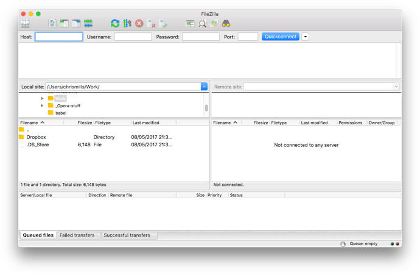
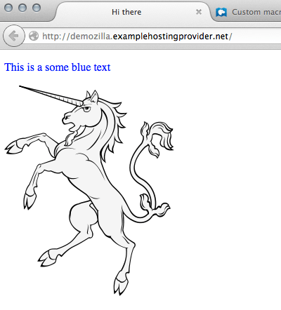

# software necesario para crear un sitio web

Para crear e editar un sitio web, necesitas un editor de texto. Os editores de texto crean e modifican  arquivos de texto sen formato. Outros formatos, como **[RTF ](https://developer.mozilla.org/en-US/docs/Glossary/RTF)**, permítenche engadir formato, como negriña ou subliñado. Eses formatos non son axeitados para escribir páxinas web. 

Todos os sistemas operativos de escritorio veñen cun editor de texto básico.  E con isto bastaría, pero carecen de calquera tipo de función especifica para a escritura de código.  Se queres algo un pouco máis útil, hai infinidade de ferramentas dispoñibles.  Moitos destes editores de terceiros adoitan incluír funcións adicionais, como a cor de sintaxe, o autocompletado, as seccións plegables, a busca de código...

Aquí tes unha pequena lista de editores: 

| Sistema operativo | Editor incorporado                                           | Editor de terceiros                                          |
| ----------------- | ------------------------------------------------------------ | ------------------------------------------------------------ |
| Windows           | [Notepad](https://en.wikipedia.org/wiki/Notepad_(software))  | [Notepad++](https://notepad-plus-plus.org/)  [Visual Studio Code](https://www.visualstudio.com/)       [Web Storm](https://www.jetbrains.com/webstorm/)     [Brackets](http://brackets.io/)       [ShiftEdit](https://shiftedit.net/)       [Sublime Text](https://www.sublimetext.com/) |
| Mac OS            | [TextEdit](https://en.wikipedia.org/wiki/TextEdit)           | [TextWrangler](https://www.barebones.com/products/textwrangler/)      [Visual Studio Code](https://www.visualstudio.com/)        [Brackets](http://brackets.io/)     [ShiftEdit](https://shiftedit.net/)       [Sublime Text](https://www.sublimetext.com/) |
| Linux             | [Vi](https://en.wikipedia.org/wiki/Vi)            (All UNIX) [GEdit](https://en.wikipedia.org/wiki/Gedit)            (Gnome) [Kate](https://en.wikipedia.org/wiki/Kate_(text_editor))            (KDE) [LeafPad](https://en.wikipedia.org/wiki/Leafpad)            (Xfce) | [Emacs](https://www.gnu.org/software/emacs/)    [Vim](https://www.vim.org/)      [Visual Studio Code](https://www.visualstudio.com/)   [Brackets](http://brackets.io/)     [ShiftEdit](https://shiftedit.net/)    [Sublime Text](https://www.sublimetext.com/) |
| Chrome OS         |                                                              | [ShiftEdit](https://shiftedit.net/)                          |

### Cargando arquivos na web

Cando o teu sitio web estea listo para a súa visualización pública, terás que cargar as túas páxinas web no teu servidor web. Podes mercar espazo nun servidor en varios provedores (consulta [Canto custa facer algo na web? ](https://developer.mozilla.org/en-US/docs/Learn/Common_questions/How_much_does_it_cost)). Unha vez que decidas que provedor usar e contrates os seus servizos, o provedor enviarache por  correo electrónico a información de acceso. A forma máis común deste acceso consiste en:

-  unha URL (S)FTP

- o nome de usuario e o contrasinal que nos autoriza o acceso

  e algunha outra información necesaria para  conectarse ao seu servidor. Isto pode cambiar no futuro con solucións máis áxiles. 

  FTP é inherentemente inseguro.  Así que convén asegurarse de que o teu provedor de hospedaxe permite o uso dunha conexión segura, por exemplo, SFTP ou RSync sobre SSH.  Inda así, (S)FTP vai algo anticuado e outros sistemas de carga están empezando a facerse máis populares, como [RSync ](https://en.wikipedia.org/wiki/Rsync)ou [Git/GitHub ](https://help.github.com/articles/using-a-custom-domain-with-github-pages/). 

A carga de arquivos a un servidor web é un paso moi importante á hora de crear un sitio web. E está é unha pequen alista do software que pode axudarche a facelo

Lista de clientes básicos (S)FTP gratuítos: 

| Sistema operativo | Software FTP                                                 |                                                       |
| ----------------- | ------------------------------------------------------------ | ----------------------------------------------------- |
| Windows           | [WinSCP ](https://winscp.net) [Moba Xterm ](https://mobaxterm.mobatek.net/) | [FileZilla ](https://filezilla-project.org/) (All OS) |
| Linux             | [Nautilus/Arquivos ](https://wiki.gnome.org/action/show/Apps/Files?action=show&redirect=Apps%2FNautilus)             (Gnome) [Dolphin ](https://dolphin.com/)(KDE) | [FileZilla ](https://filezilla-project.org/) (All OS) |
| Mac OS            | [Cyberduck ](https://cyberduck.de/)                          | [FileZilla ](https://filezilla-project.org/) (All OS) |
| Chrome OS         | [ShiftEdit ](https://shiftedit.net/) (All OS)                |                                                       |

____

ref: https://developer.mozilla.org/en-US/docs/Learn/Common_questions/What_software_do_I_need

## subir os teus arquivos a un servidor web

## [SFTP ](https://developer.mozilla.org/en-US/docs/Learn/Common_questions/Upload_files_to_a_web_server#sftp)

Hai varios clientes SFTP. A nosa demostración abrangue [FileZilla ](https://filezilla-project.org/), xa que é gratuíto e dispoñible para Windows, macOS e Linux. Para instalar FileZilla vai á [páxina de descargas de FileZilla ](https://filezilla-project.org/download.php?type=client), fai clic no botón grande Descargar e, a continuación, instálao desde o arquivo de instalación do xeito habitual. 

**Nota:** Por suposto, hai moitas outras opcións. Consulte [Ferramentas de publicación ](https://developer.mozilla.org/en-US/docs/Learn/Common_questions/How_much_does_it_cost#publishing_tools.3a_ftp_client)para obter máis información. 

Abra a aplicación FileZilla;  deberías ver algo así: 

  

### [Aquí e alí: vista local e remota ](https://developer.mozilla.org/en-US/docs/Learn/Common_questions/Upload_files_to_a_web_server#here_and_there_local_and_remote_view)

Unha vez conectada, a túa pantalla debería verse así (conectamos a un exemplo noso para que che fagas unha idea): 

  

Imos examinar o que estás a ver: 

- No panel central esquerdo, ves os teus arquivos locais.  Navega ata o directorio onde almacenas o teu sitio web (p. ex `mdn`). 
- No panel central dereito, ves arquivos remotos.  Iniciamos sesión na nosa raíz FTP distante (neste caso, `users/demozilla`) 
- Podes ignorar os paneis  inferior e superior polo momento.  Respectivamente, estes son un  rexistro de mensaxes que mostra o estado da conexión entre o teu  ordenador e o servidor SFTP e un rexistro en directo de cada interacción entre o teu cliente SFTP e o servidor. 

### [Cargando ao servidor ](https://developer.mozilla.org/en-US/docs/Learn/Common_questions/Upload_files_to_a_web_server#uploading_to_the_server)

As instrucións do anfitrión de exemplo dixéronnos "Para publicar na web, coloque os seus arquivos no `Public/htdocs`Necesitas navegar ata o directorio especificado no teu panel dereito. Este  directorio é efectivamente a raíz do teu sitio web, onde estás `index.html`arquivo e outros bens irán. 

Unha vez que atopes o  directorio remoto correcto para colocar os teus arquivos, para cargalos no servidor tes que arrastralos e soltaos desde o panel esquerdo ata o  panel dereito. 

### [Están realmente en liña? ](https://developer.mozilla.org/en-US/docs/Learn/Common_questions/Upload_files_to_a_web_server#are_they_really_online)

Ata agora, todo ben, pero os arquivos están realmente en liña?  Podes comprobalo volvendo ao teu sitio web (p. ex `http://demozilla.examplehostingprovider.net/`) no teu navegador: 

  

E a nosa web está en directo! 

____

#### Outros métodos para cargar arquivos

O protocolo FTP é un método moi coñecido para publicar un sitio web, pero non o único.  Aquí tes algunhas outras posibilidades: 

- **Interfaces web** . Unha interface HTML que actúa como interface para un servizo de carga  de arquivos remoto. Proporcionado polo teu servizo de hospedaxe. 
- **[WebDAV ](https://developer.mozilla.org/en-US/docs/Glossary/WebDAV)**. Unha extensión do [HTTP ](https://developer.mozilla.org/en-US/docs/Glossary/HTTP)protocolo para permitir unha xestión máis avanzada de arquivos. 

____

DEC 2021

🔖:
ref: https://developer.mozilla.org/en-US/docs/Learn/Common_questions/Upload_files_to_a_web_server
